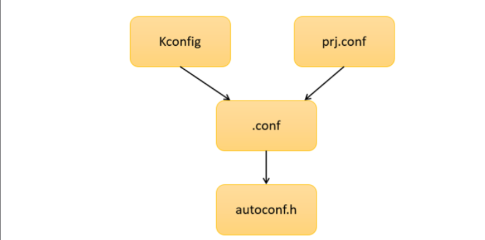
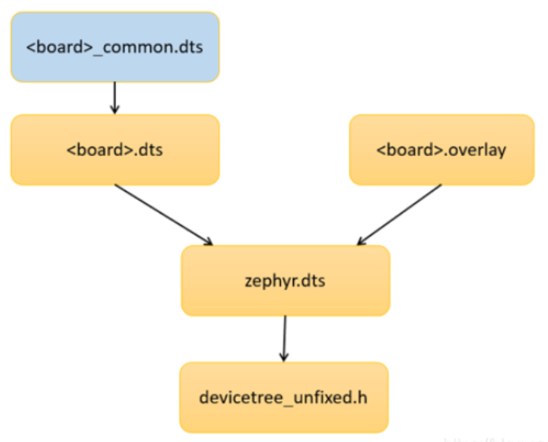

# Zephyr学习笔记
--------------------------------------
## 一、开发环境的搭建
west工具:类似git \
west init+west updtate可以从github上下载zephyr源码。\

west工具也可扩展：\
West  build:扩展指令\
```mkdir build & cd build cmake -GNinja -DBOARD=<boards> ninja ...```    
```cmake -B build_dir -S source_dir -G Ninja -DBOARD = board```\
[参考链接](https://blog.csdn.net/My_CSDN_IT/article/details/118180074)

## SDK结构
```
.
├── bootloader
├── modules
├── small_project     用户程序
├── tools
└── zephyr

```
## zephyr
```
zephyr\
 ├──  arch 		        包含和硬件体系结构相关的代码，每种平台占一个相应的目录\
 ├──  boards 			板级代码及相关的配置文件，如 nRF9160_pca10090 等\
 ├──  cmake 			构建 Zephyr 需要额外的构建脚本\
 ├──  doc 				系统文档目录\
 ├──  drivers 			设备驱动，每个不同的驱动占用一个子目录\
 ├──  dts 				devicetrree 源文件，用于描述特定板子的设备细节，如外设寄存器数量及寄存器地\址
 ├──  ext 				其他功能的支持\
 ├──  include 			包括所有公共 api 的文件，除了在 lib 下定义的部分\
 ├──  kernel 			与架构无关的内核代码\
 ├──  lib 				库代码，包括最小的标准 C 库\
 ├──  misc 				不属于任何其他顶级目录的杂项代码\
 ├──  modules 			提供特定芯片系列的一些外设配置选项\
 ├──  samples 			演示使用 Zephyr 特性的示例应用程序\
 ├──  scripts 			用于构建和测试 Zephyr 应用程序的各种程序和其他文件。\
 ├──  soc 				SoC 相关代码和配置文件，如 nRF9160 soc\
 ├──  subsys 			zephyr 子系统，包括 USB，网络，文件系统及蓝牙等\
 ├──  tests 	        测试 Zephyr 特性的代码\
 ├──  CMakeLists.txt 	CMake 构建系统的顶层文件，包含构建 Zephyr 所需的大量逻辑\
 ├──  Kconfig 			顶层 Kconfig 文件，它引用 Kconfig.zephyr 文件。也可以在顶级目录中找到\
 ├──  west.yml 			West 清单，列出由 West 命令行工具管理的外部存储库\
```

## 用户程序```small_project```

```
.
├── CMakeLists.txt
├── boards
├── build_dir
└── src
```
boards：        用户PCBA板\
build_dir:      各种输出文件\
src：           用户程序\
在当前目录下,使用```west build -b stm32f030_demo -d build_dir```命令编译，stm32f030_deom是zephyr本身支持的开发板

### ```CMakeLists.txt```分析:
```CMake
1、make_minimum_required(VERSION 3.13.1)
2、find_package(Zephyr REQUIRED HINTS $ENV{ZEPHYR_BASE})
3、project(zephyr_prj)
4、target_sources(app PRIVATE src/main.c)
5、zephyr_include_directories(src)
```

<font color=green>第二行：</font>是表示在 ZEPHYR_BASE 目录中寻找命名为 Zephyr 的模块。
```$ENV{ZEPHYR_BASE}```设计了 zephyr的根目录路径。
可以通过```message("--------_DIR=$ENV{ZEPHYR_BASE}--------")```打印出来```_DIR=/home/zager/softproject/zephyr_test/zephyr```

```
编译时执行的 build.py 脚本中引用了 zephyr\scripts\west_commands\zephyr_ext_common.py，在这个脚本中设置了 ZEPHYR_BASE 的宏。

在 cmake 的文档中找到关键注释：

cmake 模块的 Module Mode 和 Config Mode 为：<PackageName>Config.cmake 或 Find<PackageName>.cmake
cmake 模块的 Search Procedure 为：<prefix>/(lib/<arch>|lib*|share)/<name>*/(cmake|CMake)/
于是，根据这个提示我们找到名为 Zephyr 的模块文件：zephyr\share\zephyr-package\cmake\ZephyrConfig.cmake。

ZephyrConfig.cmake 调用 zephyr\cmake\app\boilerplate.cmake，它将处理 Device tree 和 Kconfig 等配置信息，最终生成必要的头文件，它还会关联其他的相关文件及 Zephyr 下的 CMakeLists.txt 文件，这个 CMakeLists.txt 又会关联其他的配置文件以及 zephyr\cmake\flash\CMakeLists.txt，最终完成整个编译的过程。

 
编译完成后，会在生成的 <build> 文件夹下生成一个名为 CMakeCache.txt 的文件，这个文件记录了编译过程中保存的一些变量值和文件，还有相关的文件路径，这些信息用来烧录与调试。

CMakeCache.txt 文件包含 West 在烧录时使用的默认值，例如开发板目录 (.dts) 在文件系统上的位置、以多种格式烧录的内核二进制文件的路径等等。 你可以在运行时使用其他选项覆盖此配置。
```
----------------------------------------------------------------

# 二、关于zephyr的配置
## ```prj.conf```文件
    软件配置文件

## ```boards_name.overlay```文件
    硬件配置文件

## ```Kcongig```文件
    配置界面的源文件.如果不用GUI界面来配置工程，该文件无意义

## 软件配置
```autoconf.h```文件是<font color=red>编译过程中</font>由许多的```Kconfig```文件生成的。基本上每个模块都有自己的```Kconfig```文件


通过更改`prj.conf`文件可以更改默认的`Kcongig`选项，而且该更改是永久的，并且只适用本项目

## 硬件配置
`devicetree_unfixed.h`文件流程:


board.dts是不同类型开发板的默认硬件配置\
board.overlay是每个项目的的硬件配置文件\
通过更改.overlay就可以更改默认配置

-----------------------------------------------------------------------

# 三、zephyr自定义开发板
[参考链接](https://docs.zephyrproject.org/latest/develop/application/index.html#custom-board-devicetree-and-soc-definitions)\
`west build -b vulture_mcb_g473 -d build_dir -- -DBOARD_ROOT="west topdir/small_project"`\

## 具体步骤
  1、在找到近似的开发板，如：zephyr\boards\arm\nucleo_g474re    \
  2、将其复制到对应的boards/arm目录下\
```
.
├── Kconfig.board
├── Kconfig.defconfig
├── arduino_r3_connector.dtsi
├── board.cmake
├── doc
│   ├── img
│   │   └── nucleo_g474re.jpg
│   └── index.rst
├── nucleo_g474re.dts
├── nucleo_g474re.yaml
├── nucleo_g474re_defconfig
└── support
    └── openocd.cfg

```
  3、修改如下的`nucleo_g474re.dts,nucleo_g474re.yaml,nucleo_g474re_defconfig`文件名(和开发板名字所匹配)\

```
.
├── Kconfig.board
├── Kconfig.defconfig
├── arduino_r3_connector.dtsi
├── board.cmake
├── doc
│   ├── img
│   │   └── nucleo_g474re.jpg
│   └── index.rst
├── support
│   └── openocd.cfg
├── zager_board_02.dts
├── zager_board_02.yaml
└── zager_board_02_defconfig
```

  4、执行对应的命令`west build -b vulture_mcb_g473 -d build_dir -- -DBOARD_ROOT="west topdir/small_project"`

----------------------------------------------

#   四、用户程序的开发


